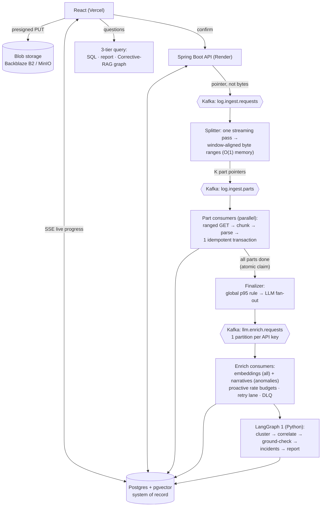

# LogLens — LangGraph-Based Log Intelligence Pipeline

**Turn a GB-scale log archive into a grounded, cited incident report you can
interrogate in plain English.**

Upload a log file → LogLens parses it deterministically for *exact* metrics, uses an
LLM to explain only the anomalous windows, correlates them into incidents, and lets
you ask questions answered with citations to the exact log lines. All the expensive AI
work runs **off the request path, behind a durable queue** — so the system is cheap,
never loses work, and scales its reasoning cost with the number of *incidents*, not the
size of the logs.

🔗 **Live:** [deeploglens.vercel.app](https://deeploglens.vercel.app)

---

## Why it exists

Making sense of a large log archive is a real, expensive problem. The naive fix —
"paste the logs into an LLM and ask what broke" — fails, because an LLM **cannot
count**, **cannot see all the logs at once**, and **will confidently invent** numbers
and errors. LogLens is built around *trust*:

- **Numbers come from code, not the model.** Deterministic parsers compute every count,
  rate, and latency. LLMs never count anything.
- **Explanations must be grounded.** The LLM only explains anomalies, and a second
  "judge" model rejects any claim not supported by the evidence.
- **Answers are cited.** Every Q&A response points at the exact log lines it used.

---

## Architecture



**Two golden rules the whole design follows:**
1. *The user-facing request path never does heavy work* — upload returns in
   milliseconds; everything expensive happens asynchronously behind Kafka.
2. *Kafka moves facts, blob moves bytes, Postgres holds truth* — messages are tiny
   pointers, file content never travels through Kafka, every result lands in Postgres.

---

## Tech stack

| Layer | Technology | Role |
|---|---|---|
| Frontend | React + Vite (Vercel) | upload, live progress (SSE), report, cited chat |
| Backend | **Java + Spring Boot** (Render) | auth, presigned upload, all Kafka workers, query APIs |
| AI orchestrator | **Python + FastAPI + LangGraph** | the two AI graphs: report writing + corrective-RAG Q&A |
| Messaging | **Kafka** (Redpanda Cloud) | durable buffer; one partition per API key for lock-free rate limiting |
| Blob storage | Backblaze B2 / MinIO (S3 API) | disposable staging for the raw file; presigned direct-to-blob upload |
| Database | **PostgreSQL 16 + pgvector** | single system of record — relational + vector + full-text |
| LLM | Groq (chat/narratives) + Gemini (embeddings) | pluggable behind a provider gateway |

---

## What makes the engineering interesting

- **Memory-bounded ingest.** A streaming splitter emits *window-aligned byte ranges*
  ("virtual parts", the Hadoop input-split idea); parallel consumers do S3 **ranged
  GETs** — heap stays **constant** whether the file is 1 MB or 10 GB, no whole-file read.
- **Rate limits modeled as Kafka partitions.** One partition ↔ one API key ↔ one
  consumer, so each worker self-paces to its quota with **zero distributed
  coordination**, and a proactive per-key token budget makes 429s a non-event by
  construction.
- **Exactly-once *effect* on at-least-once delivery.** A marker row written in the same
  transaction as each part's data (plus fingerprint- and id-keyed upserts) makes every
  redelivery a harmless no-op — no double counts, no lost work; a crash resumes from the
  last committed offset.
- **Two-layer extraction.** Regex/Java parsers compute exact metrics on *every* window;
  the LLM touches *only* anomalous ones — **~90% fewer LLM calls**, and numbers are never
  hallucinated.
- **Per-session vector isolation.** Each session gets its own chunk table with a
  right-sized **HNSW** index, sidestepping the filtered-ANN recall collapse of a shared
  vector table.
- **Corrective RAG** for Q&A: retrieve → grade → (rewrite → re-retrieve)* → generate,
  over **RRF-fused** hybrid vector + full-text search, with citations grounded to exact
  log lines.
- **LLM-as-judge grounding loop** so the generated report can't state a claim the
  evidence doesn't support.

---

## Repository layout

```
loglens-backend/     Spring Boot: auth, upload, Kafka ingest + enrich workers, query APIs
rag-orchestrator/    Python FastAPI + LangGraph: report graph + corrective-RAG Q&A graph
loglens-frontend/    React + Vite UI
docker-compose.yml   local stack: Postgres+pgvector, Kafka, MinIO
```

---

## Run it locally

```bash
# 1. Infrastructure (Postgres+pgvector, Kafka, MinIO)
docker compose up -d

# 2. Backend (Java 17+)
cd loglens-backend && ./gradlew bootRun

# 3. AI orchestrator (Python 3.11+)
cd rag-orchestrator && pip install -r requirements.txt && uvicorn app.main:app --port 8000

# 4. Frontend
cd loglens-frontend && npm install && npm run dev
```

Set `GROQ_API_KEYS` and `GEMINI_API_KEYS` (comma-separated for the multi-key rate-limit
pool). The whole stack runs on free tiers at **$0**.
