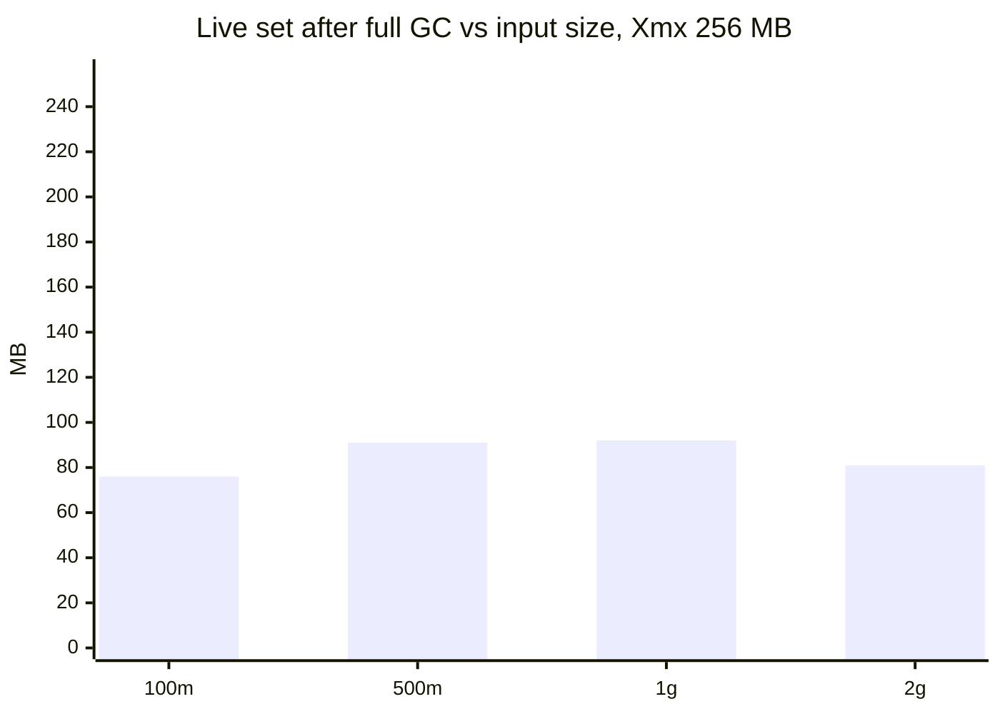
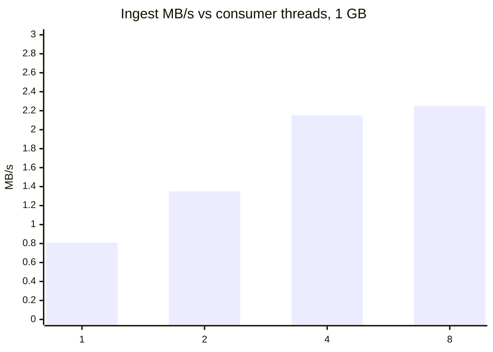

# LogLens benchmarks

All numbers come from the scripts in this folder, run against the **real backend jar**, local Kafka 3.8.0 (KRaft, 1 broker), Postgres 16.10 + pgvector 0.8.0 (shared_buffers 512 MB), MinIO, and `llm_stub.py` instead of Groq/Gemini (so the numbers describe LogLens, not a provider's rate limits, and cost $0).

**Hardware:** 4 vCPU Intel Xeon @ 2.10 GHz, 15 GB RAM, one VM shared by app + Postgres + Kafka + MinIO. **JVM:** OpenJDK 21.0.10, SerialGC (as in the production Dockerfile).

Reproduce: `docker compose up -d`, `bench/fetch_model.sh`, `python bench/llm_stub.py --embed bge &`, then `bash bench/run_all.sh` (the ingest runs, then `run_rest.sh`; finished steps are skipped). Data: `evals/generate_corpus.py` (seeded; 20 lines/s Spring-style logs).

## Ingest throughput and heap (fixed -Xmx256m, part-concurrency 3)

Timed from upload confirm until the session reaches ENRICHING (every part parsed + committed, finalizer done). Heap sampled every 250 ms with `jstat -gc` (S0U+S1U+EU+OU). Embeddings off (`--loglens.embedding.enabled=false`), so this is the parse-and-store path. The jar was built at `c5ea7d9` (robust gate + exactly-once fixes, before the `73c1fbd` line caps); the `commit` field in `ingest.json` is the checkout at run time.

| File | Bytes | Lines | Chunks | Ingest s | MB/s | Lines/s | Live set after full GC, max / median MB | Peak heap used MB | Peak RSS MB | GC pauses (count / max ms / total ms) | Status |
|---|---|---|---|---|---|---|---|---|---|---|---|
| bench_100m.log | 100,000,022 | 783,064 | 653 | 61.21 | 1.63 | 12,792 | 76 / 69 | 186.0 | 554.2 | 316 / 189.5 / 2156.3 | ENRICHING |
| bench_500m.log | 500,000,058 | 3,891,710 | 3244 | 278.79 | 1.79 | 13,959 | 91 / 75 | 227.8 | 579.7 | 1388 / 203.8 / 8293.9 | ENRICHING |
| bench_1g.log | 1,000,000,111 | 7,776,324 | 6482 | 494.13 | 2.02 | 15,737 | 92 / 76 | 226.8 | 633.1 | 2762 / 202.6 / 16696.7 | ENRICHING |
| bench_2g.log | 2,000,000,095 | 15,502,276 | 12920 | 976.78 | 2.05 | 15,870 | 81 / 70 | 203.6 | 562.0 | 5904 / 196.3 / 33951.2 | ENRICHING |

*Live set* = heap still in use right after a full collection: what the process really holds. *Peak heap used* is occupancy just before a collection, so it mostly shows how far the JVM lets the heap fill under the 256 MB cap, not what is live.

## Parallelism (1 GB file, -Xmx1g, 8 partitions, 4 vCPUs)

| part-concurrency | Ingest s | MB/s | Speed-up | Lines/s | Live set after full GC, max / median MB | Peak heap used MB | Peak RSS MB |
|---|---|---|---|---|---|---|---|
| 1 | 1235.59 | 0.81 | 1.00x | 6,293 | 56 / 52 | 133.0 | 515.4 |
| 2 | 742.55 | 1.35 | 1.67x | 10,472 | 81 / 63 | 199.2 | 570.9 |
| 4 | 465.94 | 2.15 | 2.65x | 16,689 | 111 / 90 | 272.6 | 617.7 |
| 8 | 444.79 | 2.25 | 2.78x | 17,483 | 163 / 116 | 398.4 | 806.3 |

Throughput stops scaling at the number of vCPUs (regex parsing is CPU-bound and shares the box with Postgres and Kafka); the live set grows with part-concurrency, not with file size.

## Vector isolation: shared table + filter vs per-session tables

120,000 vectors, 384-d (bge-small-en-v1.5 (ONNX)), HNSW m=16 ef_construction=64, pgvector 0.8.0. Recall@10 against exact search over the session's own rows; 50 queries per session (held-out lines of that session).

| Session (share of table) | Layout | ef_search | Recall@10 | Avg rows returned | p50 ms | p95 ms |
|---|---|---|---|---|---|---|
| big (16.67%) | shared_hnsw | 40 | 0.976 | 9.76 | 6.52 | 9.63 |
| big (16.67%) | shared_hnsw | 100 | 1.0 | 10 | 5.91 | 6.46 |
| big (16.67%) | shared_hnsw | 200 | 1.0 | 10 | 5.85 | 6.43 |
| big (16.67%) | shared_hnsw | 400 | 1.0 | 10 | 9.09 | 10.84 |
| big (16.67%) | shared_hnsw_forced | 40 | 0.908 | 9.24 | 1.72 | 3.35 |
| big (16.67%) | shared_hnsw_forced | 100 | 0.94 | 9.6 | 1.21 | 2.65 |
| big (16.67%) | shared_hnsw_forced | 200 | 0.96 | 9.6 | 1.29 | 2.3 |
| big (16.67%) | shared_hnsw_forced | 400 | 0.98 | 9.8 | 1.75 | 2.69 |
| big (16.67%) | shared_iterative | 40 | 0.954 | 9.8 | 0.6 | 0.91 |
| big (16.67%) | shared_iterative | 100 | 0.96 | 9.8 | 0.91 | 1.37 |
| big (16.67%) | shared_iterative | 200 | 0.98 | 9.8 | 1.23 | 1.8 |
| big (16.67%) | shared_iterative | 400 | 0.98 | 9.8 | 1.93 | 2.64 |
| big (16.67%) | shared_btree_exact | 40 | 1.0 | 10 | 6.09 | 6.93 |
| big (16.67%) | partial_hnsw | 40 | 0.98 | 10 | 0.8 | 1.57 |
| big (16.67%) | partial_hnsw | 100 | 1.0 | 10 | 0.93 | 1.24 |
| big (16.67%) | partial_hnsw | 200 | 1.0 | 10 | 1.33 | 1.78 |
| big (16.67%) | partial_hnsw | 400 | 1.0 | 10 | 1.8 | 2.4 |
| big (16.67%) | partitioned | 40 | 1.0 | 10 | 0.74 | 1.01 |
| big (16.67%) | partitioned | 100 | 1.0 | 10 | 1.0 | 1.27 |
| big (16.67%) | partitioned | 200 | 1.0 | 10 | 1.05 | 1.36 |
| big (16.67%) | partitioned | 400 | 1.0 | 10 | 1.39 | 1.68 |
| big (16.67%) | per_session_table | 40 | 1.0 | 10 | 0.6 | 0.92 |
| big (16.67%) | per_session_table | 100 | 1.0 | 10 | 0.66 | 0.91 |
| big (16.67%) | per_session_table | 200 | 1.0 | 10 | 1.01 | 1.51 |
| big (16.67%) | per_session_table | 400 | 1.0 | 10 | 1.26 | 1.49 |
| s000 (0.83%) | shared_hnsw | 40 | 1.0 | 10 | 0.7 | 0.92 |
| s000 (0.83%) | shared_hnsw | 100 | 1.0 | 10 | 0.61 | 0.82 |
| s000 (0.83%) | shared_hnsw | 200 | 1.0 | 10 | 0.54 | 0.62 |
| s000 (0.83%) | shared_hnsw | 400 | 1.0 | 10 | 0.58 | 0.75 |
| s000 (0.83%) | shared_hnsw_forced | 40 | 0.646 | 6.48 | 0.51 | 1.99 |
| s000 (0.83%) | shared_hnsw_forced | 100 | 0.718 | 7.24 | 0.39 | 2.1 |
| s000 (0.83%) | shared_hnsw_forced | 200 | 0.806 | 8.24 | 0.46 | 2.85 |
| s000 (0.83%) | shared_hnsw_forced | 400 | 0.872 | 8.92 | 0.44 | 3.54 |
| s000 (0.83%) | shared_iterative | 40 | 0.98 | 10 | 0.39 | 5.81 |
| s000 (0.83%) | shared_iterative | 100 | 0.978 | 10 | 0.6 | 4.77 |
| s000 (0.83%) | shared_iterative | 200 | 0.98 | 10 | 0.43 | 4.9 |
| s000 (0.83%) | shared_iterative | 400 | 0.98 | 10 | 0.64 | 5.83 |
| s000 (0.83%) | shared_btree_exact | 40 | 1.0 | 10 | 0.63 | 0.83 |
| s000 (0.83%) | partial_hnsw | 40 | 1.0 | 10 | 0.24 | 0.66 |
| s000 (0.83%) | partial_hnsw | 100 | 1.0 | 10 | 0.32 | 0.46 |
| s000 (0.83%) | partial_hnsw | 200 | 1.0 | 10 | 0.52 | 0.64 |
| s000 (0.83%) | partial_hnsw | 400 | 1.0 | 10 | 0.74 | 0.84 |
| s000 (0.83%) | partitioned | 40 | 1.0 | 10 | 0.3 | 0.35 |
| s000 (0.83%) | partitioned | 100 | 1.0 | 10 | 0.57 | 0.64 |
| s000 (0.83%) | partitioned | 200 | 1.0 | 10 | 0.56 | 0.71 |
| s000 (0.83%) | partitioned | 400 | 1.0 | 10 | 0.58 | 0.76 |
| s000 (0.83%) | per_session_table | 40 | 1.0 | 10 | 0.26 | 0.38 |
| s000 (0.83%) | per_session_table | 100 | 1.0 | 10 | 0.34 | 0.42 |
| s000 (0.83%) | per_session_table | 200 | 1.0 | 10 | 0.53 | 0.93 |
| s000 (0.83%) | per_session_table | 400 | 1.0 | 10 | 0.74 | 0.8 |
| s050 (0.83%) | shared_hnsw | 40 | 1.0 | 10 | 0.53 | 0.57 |
| s050 (0.83%) | shared_hnsw | 100 | 1.0 | 10 | 0.52 | 0.58 |
| s050 (0.83%) | shared_hnsw | 200 | 1.0 | 10 | 0.53 | 0.59 |
| s050 (0.83%) | shared_hnsw | 400 | 1.0 | 10 | 0.54 | 0.69 |
| s050 (0.83%) | shared_hnsw_forced | 40 | 0.068 | 0.68 | 0.36 | 0.95 |
| s050 (0.83%) | shared_hnsw_forced | 100 | 0.134 | 1.34 | 0.47 | 1.73 |
| s050 (0.83%) | shared_hnsw_forced | 200 | 0.208 | 2.08 | 0.44 | 2.52 |
| s050 (0.83%) | shared_hnsw_forced | 400 | 0.244 | 2.48 | 0.51 | 3.09 |
| s050 (0.83%) | shared_iterative | 40 | 0.256 | 2.6 | 0.48 | 2.96 |
| s050 (0.83%) | shared_iterative | 100 | 0.256 | 2.6 | 0.46 | 2.38 |
| s050 (0.83%) | shared_iterative | 200 | 0.256 | 2.6 | 0.59 | 3.46 |
| s050 (0.83%) | shared_iterative | 400 | 0.256 | 2.6 | 0.53 | 3.15 |
| s050 (0.83%) | shared_btree_exact | 40 | 1.0 | 10 | 0.55 | 0.68 |
| s050 (0.83%) | partial_hnsw | 40 | 1.0 | 10 | 0.29 | 0.58 |
| s050 (0.83%) | partial_hnsw | 100 | 1.0 | 10 | 0.45 | 0.63 |
| s050 (0.83%) | partial_hnsw | 200 | 1.0 | 10 | 0.58 | 0.69 |
| s050 (0.83%) | partial_hnsw | 400 | 1.0 | 10 | 1.29 | 1.41 |
| s050 (0.83%) | partitioned | 40 | 1.0 | 10 | 0.4 | 0.51 |
| s050 (0.83%) | partitioned | 100 | 1.0 | 10 | 0.88 | 1.12 |
| s050 (0.83%) | partitioned | 200 | 1.0 | 10 | 0.69 | 0.92 |
| s050 (0.83%) | partitioned | 400 | 1.0 | 10 | 0.78 | 0.92 |
| s050 (0.83%) | per_session_table | 40 | 1.0 | 10 | 0.24 | 0.31 |
| s050 (0.83%) | per_session_table | 100 | 1.0 | 10 | 0.36 | 0.43 |
| s050 (0.83%) | per_session_table | 200 | 1.0 | 10 | 0.67 | 0.79 |
| s050 (0.83%) | per_session_table | 400 | 1.0 | 10 | 0.79 | 0.89 |

Index build: shared HNSW 15.37 s (153 MB); partitioned 10.84 s; per-session tables (3) 3.32 s.

## Exactly-once effects under fault injection (`chaos.py`)

Each scenario ingests the 6 h medium-noise archive (5.7 MB, small 256 KB parts so there are ~22 parts to crash between) and compares with a clean baseline run on the same jar.

| Jar | Scenario | Chunks | Line sum | Dup line starts | Metric sum | Finding occurrences | Enriched/total | Status | Redelivery skips logged |
|---|---|---|---|---|---|---|---|---|---|
| before fixes (`85ae40a`) | baseline | 360 | 43703 | 0 | 134485 | 621 | 191/191 | DONE | 0 |
| before fixes (`85ae40a`) | crash_after_part_commit | 360 | 43703 | 0 | 134485 | 621 | 191/191 | DONE | 4 |
| before fixes (`85ae40a`) | rebalance | 360 | 43703 | 0 | 134485 | 621 | 191/191 | DONE | 0 |
| before fixes (`85ae40a`) | replay_ingest | 360 | 43703 | 0 | 134485 | 621 | 191/191 | DONE | 0 |
| before fixes (`85ae40a`) | crash_after_enrich_commit | 360 | 43703 | 0 | 134485 | 657 | 191/191 | DONE | 0 |
| before fixes (`85ae40a`) | replay_enrich | 360 | 43703 | 0 | 134485 | 621 | 191/191 | DONE | 0 |
| after fixes | baseline | 360 | 43703 | 0 | 139485 | 315 | 113/113 | DONE | 0 |
| after fixes | crash_after_part_commit | 360 | 43703 | 0 | 139485 | 315 | 113/113 | DONE | 11 |
| after fixes | crash_after_enrich_commit | 360 | 43703 | 0 | 139485 | 315 | 113/113 | DONE | 0 |
| after fixes | replay_ingest_before_part_fix | 360 | 43703 | 0 | 139485 | 315 | 113/113 | DONE | 0 |
| after fixes | replay_ingest | 360 | 43703 | 0 | 139485 | 315 | 113/113 | DONE | 266 |
| after fixes | replay_enrich | 360 | 43703 | 0 | 139485 | 315 | 113/113 | DONE | 1970 |
| after fixes | rebalance | 360 | 43703 | 0 | 139485 | 315 | 113/113 | DONE | 1 |

Notes: before/after baselines differ in metric sum and occurrences because the anomaly gate changed (robust mode flags 77 windows instead of 155). What matters is each scenario vs its own baseline.
`replay_ingest_before_part_fix`: data unchanged, but the replay later flipped 4 DONE sessions to FAILED (fixed in `c5ea7d9`, see `ExactlyOnceIT.replayAfterTheStagedBlobIsDeletedIsASilentNoOp`).

## Robustness: bad inputs (-Xmx256m)

Before = jar built at `c5ea7d9`; after = current code (`73c1fbd` line caps, NUL handling, gzip check, chunk caps + the NUL-safe failure marker). A good outcome is a clear final state: parsed (ENRICHING/CORRELATING/DONE) or FAILED with a reason, never stuck.

| Case | Bytes | Before | After |
|---|---|---|---|
| malformed_lines.log | 47,574 | **CORRELATING** in 1.2 s, chunks 10, lines 686 | **CORRELATING** in 0.6 s, chunks 10, lines 686 |
| non_utf8.log | 34,209 | **CORRELATING** in 0.6 s, chunks 10, lines 601 | **DONE** in 0.6 s, chunks 10, lines 601 |
| nul_bytes.log | 34,206 | **PARSING** in 300.4 s, chunks 0, lines 0: org.springframework.kafka.KafkaException: Seek to current after exception | **DONE** in 0.6 s, chunks 10, lines 601 |
| empty.log | 0 | **DONE** in 0.6 s, chunks 0, lines 0 | **DONE** in 0.6 s, chunks 0, lines 0 |
| archive.log.gz | 2,649 | **PARSING** in 300.2 s, chunks 0, lines 0: org.springframework.kafka.KafkaException: Seek to current after exception | **FAILED** in 0.6 s, chunks 0, lines 0: Ingest failed: Compressed archive (gzip/zip) is not supported: upload the plain-text log |
| huge_single_line.log | 104,857,634 | **CHUNKING** in 301.5 s, chunks 0, lines 0: java.lang.OutOfMemoryError: Java heap space | **DONE** in 7.7 s, chunks 1, lines 1 |
| busy_minute.log | 14,148,619 | **FAILED** in 53.8 s, chunks 0, lines 0: Part 0 failed: PreparedStatementCallback; SQL [INSERT INTO log_chunks_s_405d20e7_7e22_4a36_9a92_668cebecfce4 (chunk_id, document_id, time_bu | **DONE** in 17.5 s, chunks 60, lines 120000 |
| poison_message | - | DLQ offsets log.ingest.dlq:0:306 -> log.ingest.dlq:0:307; next upload DONE | DLQ offsets log.ingest.dlq:0:305 -> log.ingest.dlq:0:306; next upload DONE |

## Other measured numbers

| Metric | Value | How |
|---|---|---|
| Upload → DONE, owner 10k-line log | 21.2 s | `client.py` smoke run, stub LLM, bge embeddings |
| Upload → parsed (ENRICHING), same | 2.1 s | same |
| Hybrid retrieval p50 / p95 | 36.0 / 45.0 ms | `evals/run_retrieval.py`, stored tsvector |
| Lexical leg p50, expression vs stored tsvector | 1,374 → 19.3 ms | same |
| Consumer recovery after kill -9 | ~30 s | time until 'already processed' logs after restart (session timeout) |
