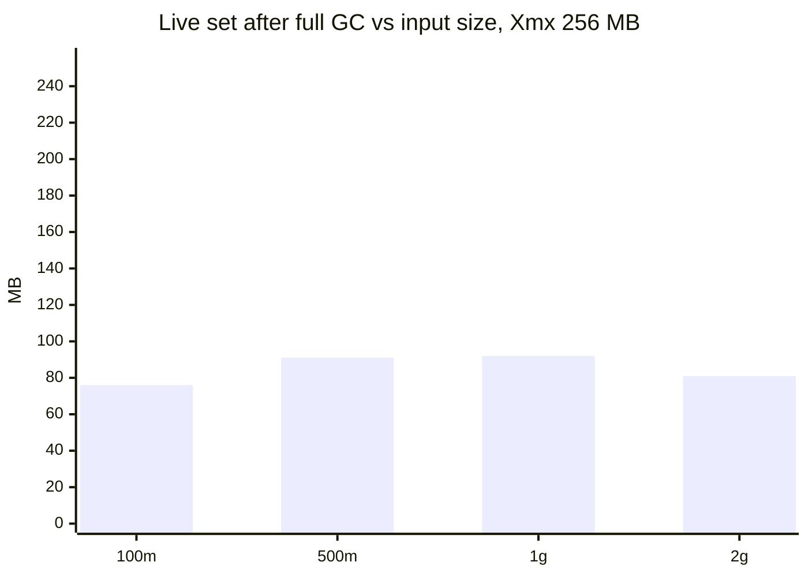

# LogLens benchmarks

All numbers come from the scripts in this folder, run against the **real backend jar**, local Kafka 3.8.0 (KRaft, 1 broker), Postgres 16.10 + pgvector 0.8.0 (shared_buffers 512 MB), MinIO, and `llm_stub.py` instead of Groq/Gemini (so the numbers describe LogLens, not a provider's rate limits, and cost $0).

**Hardware:** 4 vCPU Intel Xeon @ 2.10 GHz, 15 GB RAM, one VM shared by app + Postgres + Kafka + MinIO. **JVM:** OpenJDK 21.0.10, SerialGC (as in the production Dockerfile).

Reproduce: `docker compose up -d`, `bench/fetch_model.sh`, `python bench/llm_stub.py --embed bge &`, then `bash bench/run_all.sh`. Data: `evals/generate_corpus.py` (seeded; 20 lines/s Spring-style logs).

## Ingest throughput and heap (fixed -Xmx256m, part-concurrency 3)

Timed from upload confirm until the session reaches ENRICHING (every part parsed + committed, finalizer done). Heap sampled every 250 ms with `jstat -gc` (S0U+S1U+EU+OU). Embeddings off (`--loglens.embedding.enabled=false`), so this is the parse-and-store path. The jar was built at `c5ea7d9` (robust gate + exactly-once fixes, before the `73c1fbd` line caps); the `commit` field in `ingest.json` is the checkout at run time.

| File | Bytes | Lines | Chunks | Ingest s | MB/s | Lines/s | Live set after full GC, max / median MB | Peak heap used MB | Peak RSS MB | GC pauses (count / max ms / total ms) | Status |
|---|---|---|---|---|---|---|---|---|---|---|---|
| bench_100m.log | 100,000,022 | 783,064 | 653 | 61.21 | 1.63 | 12,792 | 76 / 69 | 186.0 | 554.2 | 316 / 189.5 / 2156.3 | ENRICHING |
| bench_500m.log | 500,000,058 | 3,891,710 | 3244 | 278.79 | 1.79 | 13,959 | 91 / 75 | 227.8 | 579.7 | 1388 / 203.8 / 8293.9 | ENRICHING |
| bench_1g.log | 1,000,000,111 | 7,776,324 | 6482 | 494.13 | 2.02 | 15,737 | 92 / 76 | 226.8 | 633.1 | 2762 / 202.6 / 16696.7 | ENRICHING |
| bench_2g.log | 2,000,000,095 | 15,502,276 | 12920 | 976.78 | 2.05 | 15,870 | 81 / 70 | 203.6 | 562.0 | 5904 / 196.3 / 33951.2 | ENRICHING |

*Live set* = heap still in use right after a full collection: what the process really holds. *Peak heap used* is occupancy just before a collection, so it mostly shows how far the JVM lets the heap fill under the 256 MB cap, not what is live.

## Exactly-once effects under fault injection (`chaos.py`)

Each scenario ingests the 6 h medium-noise archive (5.7 MB, small 256 KB parts so there are ~22 parts to crash between) and compares with a clean baseline run on the same jar.

| Jar | Scenario | Chunks | Line sum | Dup line starts | Metric sum | Finding occurrences | Enriched/total | Status | Redelivery skips logged |
|---|---|---|---|---|---|---|---|---|---|
| before fixes (`85ae40a`) | baseline | 360 | 43703 | 0 | 134485 | 621 | 191/191 | DONE | 0 |
| before fixes (`85ae40a`) | crash_after_part_commit | 360 | 43703 | 0 | 134485 | 621 | 191/191 | DONE | 4 |
| before fixes (`85ae40a`) | rebalance | 360 | 43703 | 0 | 134485 | 621 | 191/191 | DONE | 0 |
| before fixes (`85ae40a`) | replay_ingest | 360 | 43703 | 0 | 134485 | 621 | 191/191 | DONE | 0 |
| before fixes (`85ae40a`) | crash_after_enrich_commit | 360 | 43703 | 0 | 134485 | 657 | 191/191 | DONE | 0 |
| before fixes (`85ae40a`) | replay_enrich | 360 | 43703 | 0 | 134485 | 621 | 191/191 | DONE | 0 |
| after fixes | baseline | 360 | 43703 | 0 | 139485 | 315 | 113/113 | DONE | 0 |
| after fixes | crash_after_part_commit | 360 | 43703 | 0 | 139485 | 315 | 113/113 | DONE | 11 |
| after fixes | crash_after_enrich_commit | 360 | 43703 | 0 | 139485 | 315 | 113/113 | DONE | 0 |
| after fixes | replay_ingest_before_part_fix | 360 | 43703 | 0 | 139485 | 315 | 113/113 | DONE | 0 |
| after fixes | replay_ingest | 360 | 43703 | 0 | 139485 | 315 | 113/113 | DONE | 266 |
| after fixes | replay_enrich | 360 | 43703 | 0 | 139485 | 315 | 113/113 | DONE | 1970 |
| after fixes | rebalance | 360 | 43703 | 0 | 139485 | 315 | 113/113 | DONE | 1 |

Notes: before/after baselines differ in metric sum and occurrences because the anomaly gate changed (robust mode flags 77 windows instead of 155). What matters is each scenario vs its own baseline.
`replay_ingest_before_part_fix`: data unchanged, but the replay later flipped 4 DONE sessions to FAILED (fixed in `c5ea7d9`, see `ExactlyOnceIT.replayAfterTheStagedBlobIsDeletedIsASilentNoOp`).

## Other measured numbers

| Metric | Value | How |
|---|---|---|
| Upload → DONE, owner 10k-line log | 21.2 s | `client.py` smoke run, stub LLM, bge embeddings |
| Upload → parsed (ENRICHING), same | 2.1 s | same |
| Hybrid retrieval p50 / p95 | 36.0 / 45.0 ms | `evals/run_retrieval.py`, stored tsvector |
| Lexical leg p50, expression vs stored tsvector | 1,374 → 19.3 ms | same |
| Consumer recovery after kill -9 | ~30 s | time until 'already processed' logs after restart (session timeout) |
