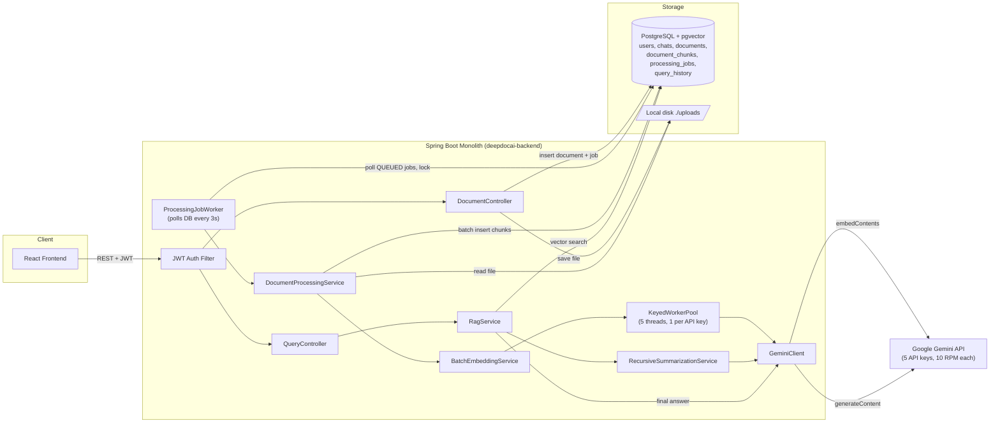
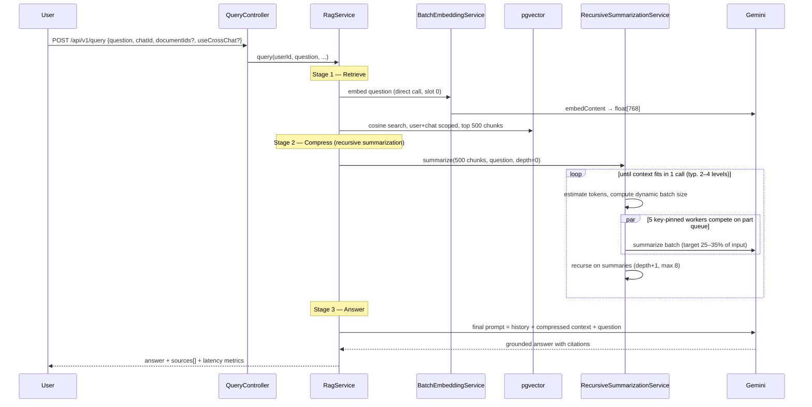

# ChunkAI (DeepDocAI) — Current Architecture, In Depth

> Audience: you (interview prep) and any agent/dev taking over this codebase.
> Everything in this document is verified against the code as of 2026-07-14. File paths are given so you can re-verify.

---

## 1. What the system is

A RAG (Retrieval-Augmented Generation) document Q&A application. Users upload documents in bulk (PPT/PDF/images/text — e.g. 50–100 lecture slides), the system extracts, chunks, and embeds them into a vector store, and then answers questions **grounded in those documents** with source attribution (file + page/slide). Grounding + citation is the anti-hallucination strategy: the LLM is never asked to answer from its own knowledge when document context exists.

**Stack (current):**

| Layer | Technology | Where |
|---|---|---|
| API | Spring Boot 3.2.5, Java 17, single Gradle module | `deepdocai-backend` |
| Auth | Spring Security + JWT (stateless) | `api/security/*` |
| DB | PostgreSQL 16 + pgvector (HNSW index) | `docker-compose.yml`, `init.sql` |
| LLM | Google Gemini 2.5 Flash (generation), text-embedding-004 (768-dim embeddings) | `llm/client/GeminiClient.java` |
| Extraction | PDFBox (PDF), Apache POI (PPT/PPTX), Tesseract OCR (images) | `core/processor/impl/*` |
| File storage | Local disk `./uploads` | `core/service/impl/LocalFileStorageService.java` |
| Frontend | React + Vite + Tailwind | `examprep-frontend` |
| Job queue | PostgreSQL table `processing_jobs` + polling worker | `core/service/ProcessingJobWorker.java` |
| LLM work queue | In-memory `LinkedBlockingQueue` + key-pinned worker threads | `llm/worker/KeyedWorkerPool.java` |

**Package layout** (one Spring Boot module, layered by package — the old multi-module `examprep-*` split was collapsed):

```
com.deepdocai
├── api        → controllers, DTOs, security (JWT), exception handler
├── common     → constants (FileTypes, ProcessingStatus), utils (FileUtils, TokenCounter)
├── core       → document processors, chunking, file storage, job worker, DocumentProcessingService
├── data       → JPA entities + repositories (incl. custom native-SQL repos for pgvector)
└── llm        → GeminiClient, ApiKeyManager/slots, KeyedWorkerPool, embedding + RAG services, prompts
```

---

## 2. High-level architecture diagram



---

## 3. Database schema (and *why* each piece exists)

Schema source of truth: [init.sql](../init.sql). Six tables.

### 3.1 `users`
`id (UUID PK)`, `email (unique)`, `password_hash` (BCrypt), `full_name`, timestamps, `is_active`.
Index on `email` for login lookups.

### 3.2 `chats`
Chat sessions. `id`, `user_id FK`, `title TEXT`, timestamps. Documents and queries are **scoped to a chat**, which enables "search only this chat's documents" vs cross-chat search. `title` is `TEXT` (was `VARCHAR`, migrated — LLM-generated titles overflowed).

### 3.3 `documents`
File metadata + processing lifecycle. Key columns:
- `user_id`, `chat_id` — ownership scoping (multi-tenancy).
- `file_type` ∈ {ppt, pptx, pdf, image, txt}, `file_size_bytes`, `mime_type`.
- `processing_status` ∈ **PENDING → PROCESSING → COMPLETED | FAILED** (enforced by CHECK constraint), plus `processing_started_at/completed_at`, `error_message`.
- `total_pages`, `total_chunks` — filled in on completion.
- Index `(chat_id, original_file_name, file_size_bytes)` — **duplicate-upload detection** (same name + size in same chat → return existing doc instead of reprocessing).

### 3.4 `document_chunks` — the heart of the RAG store
- `document_id FK`, plus **denormalized** `user_id` and `chat_id`. *Why denormalize?* Vector search must filter by user/chat; a JOIN inside a similarity query would slow the hot path. Duplication buys a direct indexed filter.
- `chunk_index` (order within doc, `UNIQUE(document_id, chunk_index)`), `content TEXT`, `content_hash` (SHA-256, dedup), `page_number`/`slide_number`/`section_title` (source attribution), `token_count`.
- `embedding vector(768)` — pgvector column, 768 dims = text-embedding-004 output size.
- **HNSW index**: `USING hnsw (embedding vector_cosine_ops) WITH (m = 16, ef_construction = 64)`.

**HNSW under the hood (interview-ready):** Hierarchical Navigable Small World is a multi-layer graph. Every vector is a node; each node keeps up to `m=16` links to near neighbors per layer. Upper layers are sparse "express lanes", the bottom layer contains all vectors. A search enters at the top layer, greedily walks toward the query, and drops down a layer each time it can't improve — like binary search over a skip list, but in vector space. `ef_construction=64` is the candidate-list size while building (bigger = better recall, slower build). This gives **approximate** nearest-neighbor search in ~O(log n) instead of an exact O(n) scan — the trade is a small recall loss for a large speedup. Distance operator used: `<=>` = cosine distance; similarity = `1 - distance`.

### 3.5 `processing_jobs` — a database-as-queue
- `document_id FK`, `status` ∈ QUEUED → PROCESSING → COMPLETED | FAILED, `priority` (1–10).
- Retry bookkeeping: `attempts`, `max_attempts=3`, `last_error`.
- **Cooperative locking**: `locked_by` (worker id), `locked_until` (now + 5 min). A crashed worker's lock simply expires; the job becomes claimable again.
- Partial index `ON (status, priority, created_at) WHERE status = 'QUEUED'` — the "fetch next job" query only ever looks at QUEUED rows, so index only those.

### 3.6 `query_history`
Every Q&A: `query_text`, `query_embedding vector(768)` (stored for future semantic caching/analytics), `answer_text`, `sources_used JSONB`, and per-stage latency metrics (`retrieval_time_ms`, `generation_time_ms`, `total_time_ms`, `chunks_retrieved`).

### 3.7 In-database search function
`search_similar_chunks(user_id, query_embedding, limit, document_ids[])` — plpgsql function doing the scoped cosine search with a JOIN to `documents` filtered to `processing_status = 'COMPLETED'` (never retrieve from half-processed docs). The Java side has an equivalent custom repository (`DocumentChunkRepositoryImpl`) that builds the same query with chat/cross-chat scoping.

---

## 4. Data flow #1 — Document upload & ingestion pipeline

```mermaid
sequenceDiagram
    participant U as User
    participant DC as DocumentController
    participant FS as LocalFileStorage
    participant PG as PostgreSQL
    participant JW as ProcessingJobWorker
    participant DPS as DocumentProcessingService
    participant BES as BatchEmbeddingService
    participant KWP as KeyedWorkerPool (5 threads)
    participant G as Gemini API

    U->>DC: POST /api/v1/documents/upload (multipart, chatId)
    DC->>DC: validate file, verify chat ownership, duplicate check (name+size per chat)
    DC->>PG: INSERT document (PENDING)
    DC->>FS: save file to ./uploads/{docId}
    DC->>PG: INSERT processing_job (QUEUED)
    DC-->>U: 200 DocumentResponse (immediately — processing is async)

    loop every 3 seconds (@Scheduled)
        JW->>PG: SELECT queued jobs (priority order, skip locked)
        JW->>PG: lock job (locked_by=workerId, locked_until=+5min, attempts+1)
        JW->>DPS: processDocument(docId)  [max 5 in parallel]
    end

    DPS->>PG: TX1: status=PROCESSING, delete old chunks
    DPS->>FS: read file (retry up to 5x if not yet flushed)
    DPS->>DPS: extract text (PDFBox/POI/Tesseract by type)
    DPS->>DPS: chunk by page/slide (ChunkingService)
    DPS->>BES: generateEmbeddings(all chunk texts)
    BES->>KWP: split into batches of 80, enqueue as WorkItems
    par 5 workers, one per API key
        KWP->>G: batchEmbedContents(80 texts) — rate-limited 7.5s/key
        G-->>KWP: 80 × float[768]
    end
    BES-->>DPS: embeddings (order preserved; failed batches = null)
    DPS->>PG: TX2: batch INSERT chunks + status=COMPLETED
    JW->>PG: mark job COMPLETED (or requeue on failure, attempts < 3)
```

### Under the hood, step by step

**1. Upload endpoint** ([DocumentController.java](../deepdocai-backend/src/main/java/com/deepdocai/api/controller/DocumentController.java)) — validates the file (extension + size via `FileUtils`), verifies the chat belongs to the JWT user (403 otherwise), checks duplicates by `(chatId, originalFileName, fileSizeBytes)` and short-circuits with the existing document. Creates the `documents` row first (to get the UUID), then writes the file to disk named by that UUID, then inserts a `processing_jobs` row. Returns immediately — **the HTTP request never waits for processing**.

**2. Job pickup** ([ProcessingJobWorker.java](../deepdocai-backend/src/main/java/com/deepdocai/core/service/ProcessingJobWorker.java)) — `@Scheduled(fixedDelay = 3000)` polls for QUEUED jobs, takes up to 5, and runs each on a fixed thread pool. Each job is **locked** by writing `locked_by` + `locked_until = now + 5 min` in its own `REQUIRES_NEW` transaction, `saveAndFlush`ed so the lock is visible to other transactions immediately. Failure handling is deliberately paranoid: failure status is written in a *separate* `REQUIRES_NEW` transaction (so a rolled-back processing transaction can't roll back the failure record), with a last-resort fallback that resets the job to QUEUED so nothing is ever stuck in PROCESSING forever.

**3. Transaction discipline** ([DocumentProcessingService.java](../deepdocai-backend/src/main/java/com/deepdocai/core/service/DocumentProcessingService.java)) — this is an interview gold nugget. Processing a document can take **minutes** (rate-limited LLM calls). Holding a DB transaction (and its connection) open that long exhausts the Hikari pool. So the flow is split into three boundaries:
   - **TX1 (short):** set status=PROCESSING, delete any old chunks (reprocessing safety).
   - **No TX (long):** extraction + chunking + embedding — pure computation and HTTP calls, zero DB connections held.
   - **TX2 (short):** batch-insert all chunks + set status=COMPLETED atomically.
   Hikari is sized at 30 connections with a 120s leak-detection threshold precisely because of this pattern.

**4. Extraction** — strategy pattern: `DocumentProcessorFactory` picks `PdfProcessor` (PDFBox, per-page text), `PptProcessor` (POI, per-slide text + titles), `ImageProcessor` (Tesseract OCR), or `TextProcessor` by file type. All return an `ExtractionResult { pageContents[], pageTitles[], totalPages }`.

**5. Chunking** — `ChunkingService.chunkByPages`: **one chunk per page/slide** (natural semantic boundary for slides/notes), carrying page/slide number + section title for citation. No fixed-size window with overlap — slides are already small, self-contained units.

**6. Embedding** — see §6 below (the worker pool is shared machinery).

**7. Persistence** — `batchSaveChunksWithEmbeddings` (custom repo, [DocumentChunkRepositoryImpl](../deepdocai-backend/src/main/java/com/deepdocai/data/repository/DocumentChunkRepositoryImpl.java)) does a native batched INSERT with vectors serialized to pgvector's `[x,y,...]` literal format. Chunks whose embedding batch failed are **skipped, not blocked on** — partial success beats total failure for a study tool.

---

## 5. Data flow #2 — Query / RAG pipeline



### Under the hood

**Stage 1 — Retrieval** ([RagService.java](../deepdocai-backend/src/main/java/com/deepdocai/llm/service/RagService.java)): the question is embedded (single direct Gemini call using key slot 0, bypassing the queue for latency), then a pgvector cosine search runs, scoped to `user_id` (+ `chat_id` unless `useCrossChat`), optionally restricted to specific `documentIds`, returning up to **500** chunks (`deepdocai.rag.max-retrieved-chunks`). 500 is deliberately huge — the philosophy is "recall first, let compression sort it out" rather than betting everything on top-10 precision.

**Stage 2 — Recursive hierarchical summarization** ([RecursiveSummarizationService.java](../deepdocai-backend/src/main/java/com/deepdocai/llm/rag/RecursiveSummarizationService.java)) — the most interesting algorithm in the codebase:

1. **Token math**: tokens ≈ `chars / 3.5`. Usable window = `1,000,000 (Gemini context) × 0.80 (utilization) × 0.85 (safety) ≈ 680k tokens`, minus system prompt, question, and an 8,192-token output reservation.
2. **Base case**: if all blocks fit → join with separators and return (no LLM calls at all for small doc sets).
3. **Dynamic batching**: `batchSize = availableTokens / avgBlockTokens` — batch size adapts to content density instead of being a fixed constant.
4. **Parallel map step**: parts go into an in-memory queue; **one worker thread per API key** competes for parts (dynamic load balancing — a worker whose key is healthy does more work). Each summarization call instructs the model to compress to 25–35% while preserving question-relevant facts, errors, timestamps, and source tags.
5. **Anti-non-compression guard**: if output ≥ 95% of input tokens (model refused to compress), keep only the first half — guarantees the recursion shrinks and terminates.
6. **Recurse** on the level's summaries (`depth+1`); prompt switches to "merge partial summaries, dedupe". Depth cap 8. Failed parts are dropped (partial context > no answer); only all-parts-failed aborts.

Worked example: 500 chunks ≈ 400k tokens → level 0 splits into ~say 3 parts → 3 summaries ≈ 120k tokens → fits → done in 2 levels, 3 LLM calls + final answer.

**Stage 3 — Final answer**: prompt = last 10 conversation turns + compressed context + question + "cite sources" instruction. System prompt differs by case: with context → strict grounded-answer prompt; **zero chunks retrieved** → fallback system prompt and, if there's also no conversation history, Gemini's **googleSearch tool** is enabled (`useInternet`) so the model can ground itself on live web results instead of hallucinating from parametric memory.

**Anti-hallucination summary (say this in the interview):** (1) answers are generated only from retrieved document context; (2) every chunk carries `[Source: file, Page/Slide: N]` tags that survive summarization and reach the final prompt, enabling citations; (3) when no context exists the system *explicitly switches modes* (web-grounded or clearly-labeled model knowledge) instead of pretending to know; (4) sources are returned to the UI so the user can verify.

---

## 6. API key management & the KeyedWorkerPool (deep dive)

Files: [ApiKeySlot.java](../deepdocai-backend/src/main/java/com/deepdocai/llm/key/ApiKeySlot.java), [ApiKeyManager.java](../deepdocai-backend/src/main/java/com/deepdocai/llm/key/ApiKeyManager.java), [KeyedWorkerPool.java](../deepdocai-backend/src/main/java/com/deepdocai/llm/worker/KeyedWorkerPool.java)

**The problem:** Gemini free-tier keys allow ~10 requests/min *per key*. One key is far too slow for bulk ingestion (100 PPTs × dozens of chunks). Solution: N keys (currently 5) used concurrently, each kept safely under its limit.

**The design evolved from round-robin to thread-pinned slots** — and the difference is worth explaining:

- *Round-robin (v1):* every thread grabs "the next" key. Requires shared mutable state (whose turn is it? when was key K last used?) → locks/CAS contention, and a burst of threads can still stampede one key.
- *Thread-pinned slots (current):* `ApiKeyManager` holds N `ApiKeySlot`s; worker thread *i* is **permanently bound** to slot *i*. Rate-limit state (`lastCallTimeMs`) is only ever touched by its one owner thread → **no locks, no contention, rate limiting becomes trivially correct local arithmetic**: sleep until `7,500ms` since the key's last call (= 8 calls/min = 80% of the 10 RPM limit, 20% headroom for clock skew and the server counting differently).

**Work distribution:** all N workers compete on a single shared `LinkedBlockingQueue<WorkItem>`. Queue poll is atomic → no double-processing; faster/healthier keys naturally take more items (dynamic load balancing). `submit()` returns a `CompletableFuture` so callers block only on *their* results.

**Failure semantics:**
- **429 (RateLimitException):** the item is **re-enqueued** (another worker with a healthy key can take it immediately), then the offending worker sleeps 60s (the RPM window reset), marks the slot recovered, resumes.
- **Other errors:** retry with re-enqueue up to 3 attempts, then complete the future exceptionally — the *caller* decides (embedding: skip that batch; summarization: drop that part).

Two consumers of this machinery:
1. **BatchEmbeddingService** — splits texts into batches of **80** (Gemini's `batchEmbedContents` accepts up to 100; 80 = safety margin), submits each batch as one work item. So one API call embeds 80 chunks: a 400-chunk document costs 5 calls, ~8 seconds of rate budget across 5 keys instead of 50 minutes with naive per-chunk calls on one key.
2. **RecursiveSummarizationService** — same pattern, its own transient per-request queue.

**Known ceiling (be upfront in interviews):** the queue is **in-memory** — a crash loses in-flight LLM work (the document job survives in `processing_jobs` and will retry from scratch). The 60s backoff **blocks a worker thread**. And key slots are per-JVM, so running 2 app instances would double the pressure per key. These three weaknesses are precisely what the Kafka redesign (doc 02) fixes.

---

## 7. Security

- **Registration/login** (`AuthController`): BCrypt password hashing; login issues a JWT (HS256, 24h expiry, subject = user UUID).
- **JwtAuthenticationFilter**: runs once per request, parses `Authorization: Bearer`, validates signature/expiry, puts the user id into the SecurityContext. Stateless — no server sessions.
- **Row-level tenancy in every query**: all repository queries filter by `user_id` extracted from the token (never from the request body). Chat ownership is re-verified on upload. Denormalized `user_id` on chunks makes this cheap on the vector hot path.

---

## 8. Configuration that matters ([application.properties](../deepdocai-backend/src/main/resources/application.properties))

| Property | Value | Why |
|---|---|---|
| `gemini.api-keys` | 5 keys, comma-sep | one worker thread each |
| `deepdocai.gemini.rate-limit-utilization` | 0.80 | 8 of 10 RPM → 7,500 ms/key |
| `deepdocai.embedding.batch-size` | 80 | ≤100 API cap, margin |
| `deepdocai.rag.max-retrieved-chunks` | 500 | recall-first retrieval |
| `deepdocai.gemini.context-limit-tokens` | 1,000,000 | Gemini 2.5 Flash window |
| `hikari.maximum-pool-size` | 30 | 5 embed + 5 summarize workers + HTTP + jobs |
| `hikari.leak-detection-threshold` | 120,000 | catch tx-held-during-API-call bugs |
| multipart max sizes | 1GB/2GB | bulk uploads |

---

## 9. Honest limitations (these motivate the target architecture)

1. **In-memory LLM work queues** — crash = lost in-flight work; no replay, no visibility, no durable backpressure.
2. **DB polling as job queue** — 3s latency floor, constant idle polling, hand-rolled locking (lock, expiry, stale-release) that Kafka consumer groups give for free.
3. **429 handling parks a thread for 60s** — throughput dies exactly when demand is highest.
4. **Single-node key management** — can't scale horizontally without keys colliding across JVMs.
5. **Vector-only retrieval** — cosine similarity is weak on exact tokens (error codes, acronyms, formula names, "slide 42"). No lexical/BM25 leg, no reranking.
6. **Linear, hard-coded RAG pipeline** — no query rewriting, no relevance grading, no groundedness check loop; the pipeline can't adapt per query.
7. **Synchronous query over HTTP** — recursive summarization of 500 chunks can take minutes on rate-limited keys while an HTTP thread waits.
8. **Local-disk file storage** — breaks with >1 instance or container restarts.

---

## 10. Interview Q&A cheat sheet (current system)

**"Walk me through what happens when a user uploads 100 PPTs."**
Controller validates + dedupes each, writes file to disk, inserts `documents` + `processing_jobs` rows, returns instantly. A scheduled worker polls the job table, claims up to 5 jobs with time-boxed DB locks, and runs the pipeline: extract per slide → chunk per slide → batch-embed 80-at-a-time through a 5-key worker pool → batch-insert into pgvector. Statuses go PENDING→PROCESSING→COMPLETED, retried up to 3× on failure, stale locks self-expire.

**"How do you prevent hallucination?"** Grounding + attribution + explicit mode switch — see §5 anti-hallucination summary.

**"Why pgvector and not a dedicated vector DB?"** Data is already in Postgres, tenancy filters are indexed columns in the same store, HNSW gives ANN performance, one fewer system to run, and transactional consistency between chunks and metadata (insert chunks + flip status in one transaction). At current scale this is the right trade; ES/hybrid comes later for retrieval *quality*, not because pgvector ran out of steam.

**"How do you handle rate limits with multiple API keys?"** Thread-pinned key slots — one thread per key, shared work queue, local 7.5s interval per key, 429 → re-enqueue for a healthy key + 60s backoff on the limited one. No shared locks anywhere. (Then explain the Kafka-partition evolution from doc 02 — this is the strongest arc in the story.)

**"Why is the whole document set summarized instead of just top-k chunks?"** Slides are fragmentary; a 10-mark exam answer may need facts spread across 30 slides. Top-10 retrieval optimizes precision but starves recall. Retrieving 500 and *recursively compressing* keeps recall while still fitting the context window — a map-reduce over meaning, parallelized across keys, with a guaranteed-termination guard.

**"Where does it break at scale?"** Recite §9 — knowing your own system's weaknesses is the strongest senior signal there is.
