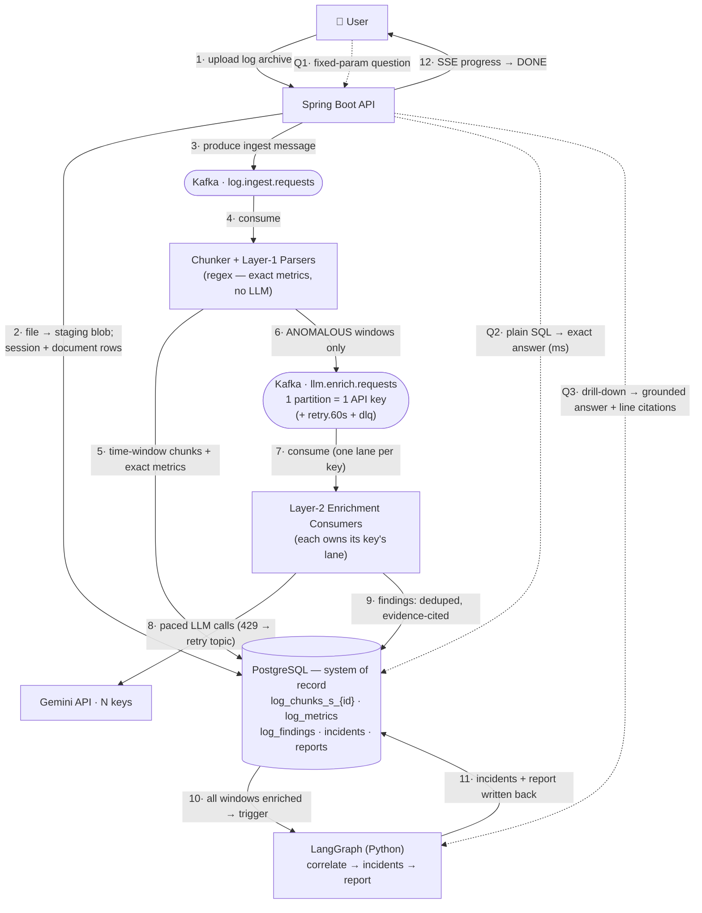
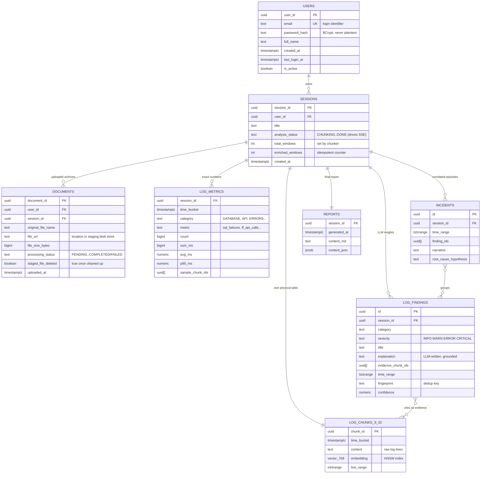

# ChunkAI — Target Architecture (FINAL, refined): Log Intelligence Pipeline

> Read [01-current-architecture.md](01-current-architecture.md) for the system as it exists today. This is the **finalized and refined target design** (2026-07-14). Refinement pass removed everything the log-analytics pivot made unnecessary — see §4 for the cut list, which is itself interview material.

---

## 1. The thesis

**ChunkAI answers whole-corpus analytical questions over production log archives — the question class where standard top-k RAG structurally fails.**

Standard RAG serves *needle-in-haystack* questions: embed query → fetch top-10 chunks → generate. It cannot answer *whole-haystack* questions ("what defect patterns appeared this week?", "reconstruct this incident", "how many SQL failures, when?") because the answer is spread across thousands of chunks and no top-k selection holds it.

ChunkAI's move: **shift LLM work from query-time to ingest-time.** Analyze the whole archive once — parsers for numbers, LLMs for meaning — materialize typed findings into tables, generate a report. User questions then hit tables via SQL: instant, exact, hallucination-proof by construction, with one grounded RAG drill-down as the escape hatch.

- A **session = one corpus** (an incident's archive, a service's daily logs): 10⁵–10⁶ chunks. A workspace, not a chat.
- Related work: GraphRAG makes the same query-time→index-time move; RAPTOR pre-builds summary trees. Ours additionally materializes *typed, structured* findings, not prose.
- **Is it still RAG?** Yes — ingest-time RAG. Every enrichment call is generation grounded in retrieved log evidence with citations; the report is generation grounded in findings; drill-down is classic query-time RAG. The loop moved left of the query.

## 2. Design goals

1. **Exactness where possible** — numbers come from deterministic parsers, never an LLM.
2. **LLM only for semantics** — explaining anomalies, classifying failures, correlating incidents, writing the report; spent only on anomalous windows.
3. **Durable, replayable enrichment** — thousands of LLM calls per corpus survive crashes and rebuild derived data on demand.
4. **Per-key rate limits preserved at any scale** — partition-per-API-key.
5. **Postgres is the only stateful system of record** — everything derived is rebuildable from it.
6. **$0 to run** — free/self-hosted everything, Gemini free tier.

## 3. The whiteboard diagram

This is the single diagram to reproduce in an interview. Solid numbered arrows = the analysis flow, in order, 1→12. The Q-arrows = what happens when the user asks something, after analysis is done.



How to read it: **1–5** get the raw material in (upload → Kafka → chunks + parser metrics). **6–9** are the LLM burst, buffered by Kafka and paced per key. **10–11** turn findings into incidents and a report, once. **12** the user watched it all via SSE. **Q1–Q3**: after that, questions are answered from tables (no LLM), except drill-down.

One Spring Boot codebase (API + Kafka consumers; split into two deployables only when scaling demands it), one Python sidecar, one database, one broker. Files land in MinIO, staged temporarily (§6).

## 4. What we deliberately do NOT use (and why — memorize this list)

Removing technology on purpose is a stronger interview signal than adding it.

| Cut | Why it's not needed in this design |
|---|---|
| **Elasticsearch** | It solved open-ended retrieval quality — a problem this design no longer has. Primary queries are SQL over materialized findings. Evidence lookup is **by ID** (`evidence_chunk_ids` → primary-key fetch). Lexical search ("every ORA-01555") is *session-scoped*, served by a Postgres GIN full-text index on the session's own table. Semantic drill-down is served by the per-session pgvector HNSW. One fewer stateful cluster to run, back up, and keep consistent. |
| **RRF / hybrid fusion** | Existed to merge ES's two retrieval legs. Gone with ES; drill-down exposes lexical and semantic search as two explicit modes. |
| **Durable/managed object storage** (AWS S3, GCS as permanent stores) | Files are **temporary staging** (§6 lifecycle): streamed once by the chunker, then deleted — the chunks in Postgres are the durable copy. MinIO (self-hosted, free, S3-compatible) covers staging from local dev through production via one `docker-compose` service — no managed cloud storage needed, and low durability requirements are a *feature* here: staging loss just means re-upload. |
| **Query-time recursive summarization** | v1's answer to "500 chunks don't fit in context." Ingest-time enrichment makes it obsolete: findings are compact structured rows, clustered deterministically before the LLM sees them. (Survives only in the legacy document-Q&A mode.) |
| **Async query API** | Queries are SQL now — milliseconds, synchronous. Only *analysis* is long-running, and its progress streams over SSE reading the session's status row. No status topic, no query-job machinery. |
| **Dedicated vector DB** (Pinecone etc.) | Per-session pgvector tables already give isolated, right-sized ANN indexes with transactional consistency to the metadata. A second vector store adds sync problems and solves nothing here. |
| **Kafka exactly-once transactions** | At-least-once + idempotent handlers (fingerprint dedup, natural-key upserts) gives equivalent correctness for these write shapes, far more simply. |
| **Microservices** | Two deployment units total, and only because the Python AI ecosystem forces the second. Everything else stays in the modular monolith. |

## 5. Two-layer extraction (the core design decision)

**"LLMs only where deterministic code fails."** An LLM must never count, sum, or average — parsers are exact, free, fast; LLMs are expensive and miscount across chunks.

```
                     every time-window chunk
                              │
              ┌───────────────┴───────────────┐
              ▼                               ▼
   LAYER 1 — PARSERS                LAYER 2 — LLM ENRICHMENT
   regex/grok, plain Java           only ANOMALOUS windows
   counts · latencies (avg/p95)     (errors, warns, outliers —
   status codes · volumes           boring windows are skipped)
   → log_metrics  (exact)           explain · classify · fingerprint
                                    → log_findings  (grounded, cited)
```

### Extraction taxonomy

1. **API activity** — calls per endpoint (incl. feature-flag APIs), latency total/avg/p95, status codes
2. **Database** — query counts, slow queries, SQL failures/deadlocks/timeouts, connection-pool events
3. **Errors & exceptions** — deduplicated by *fingerprint* (hash of exception class + top stack frames), frequency, first/last seen
4. **Downstream dependencies** — external call failures, timeouts, retries, circuit-breaker trips
5. **Performance** — GC pauses, memory warnings, thread-pool saturation, slow-request outliers
6. **Auth/security** — 401/403 spikes, auth failures, token expiries
7. **Lifecycle** — restarts, deploys, config reloads, health-check failures (often the *cause* of everything else)
8. **Traffic shape** — volume per bucket, spikes, dead periods
9. **Incidents** (LLM correlation pass) — clustered findings with narrative + root-cause hypothesis: "14:02–14:07: deploy → pool exhaustion → 340 SQL timeouts → 5xx spike"

Chunking is **by time window** (e.g., 1-minute blocks) — logs are temporal; windows align findings with metric buckets.

## 6. Data model

### How the tables relate



### What each table means, in plain words

| Table | One row is... | Written by | Read by |
|---|---|---|---|
| `users` | one account: `email` + `password_hash` (BCrypt) for login, `full_name`, `created_at`, `last_login_at`, `is_active` — matches the v1 table in `init.sql`, carries over unchanged | auth endpoints | login, JWT subject |
| `sessions` | one workspace = one log corpus; `user_id` FK, title, analysis status + progress counters | API, workers | SSE progress, everything |
| `documents` | one uploaded file: `user_id` + `session_id` FKs, `file_url` pointing into the **staging blob store**, size, processing status, and `staged_file_deleted` once cleanup runs | API on upload; chunker updates status | chunker, upload UI |
| `log_metrics` | **one exact measurement**: "in minute 14:02, category DATABASE, metric sql_failures = 340" | Layer-1 parsers (all windows) | fixed-param queries: "how many / how long" |
| `log_findings` | **one insight**: "connection pool exhausted repeatedly, likely undersized for burst traffic" + pointers to the exact chunks proving it. `fingerprint` dedups: the same anomaly seen again increments a count instead of inserting a new row | Layer-2 LLM enrichment (anomalous windows only) | correlation pass, queries by category/severity |
| `incidents` | **one episode**: a time-boxed cluster of findings with a narrative ("deploy → pool exhaustion → SQL timeouts → 5xx") and a root-cause hypothesis | LangGraph Graph 1 | report, queries |
| `reports` | the final rendered report for the session (markdown for the UI, JSON for programmatic use) | LangGraph Graph 1 | report view |
| `log_chunks_s_{id}` | one time-window of raw log lines + its embedding — the *evidence layer* everything cites into | chunker | drill-down (Graph 2), evidence display |

Mental model: **raw evidence at the bottom (`log_chunks`), exact numbers one level up (`log_metrics`), interpreted insights above that (`log_findings`), stories at the top (`incidents` → `reports`).** Every level cites the level below it — that's the anti-hallucination chain: report → incidents → findings → chunk IDs → actual log lines.

### Uploaded-file lifecycle (staging blob store)

Uploaded archives are **temporary staging, not permanent storage**:

```
 upload ──▶ staging blob store ──▶ chunker streams it once, window by window
                  │                        │
                  │                        ▼
                  │                log_chunks_s_{id}  ◀── the durable copy
                  │                (+ metrics/findings derived from it)
                  ▼
        deleted after processing completes
        (documents.staged_file_deleted = true; file_url kept for audit)
```

- The chunker **streams the file window-by-window** — it is never loaded whole into memory (archives can be GBs).
- Once chunking + parsing succeed, the raw chunks in Postgres *are* the system of record; the original file is redundant and is **deleted from staging** (optionally retained per config, e.g. re-chunk with a different window size).
- Implementation: `FileStorageService` interface backed by **MinIO** (self-hosted, S3-compatible, one container in docker-compose) — used from local dev through production, same S3 API calls throughout, so there's no separate "local disk" code path to diverge or debug. Because files are short-lived staging, durability requirements on this store are deliberately low: if staging dies mid-processing, the user re-uploads; nothing analyzed is lost. Free forever, no cloud account needed.

### Shared analysis tables (DDL sketch)

```sql
log_metrics   (session_id, time_bucket, category, metric,
               count, sum_ms, avg_ms, p95_ms, sample_chunk_ids[])

log_findings  (id, session_id, category, severity, title, explanation,
               evidence_chunk_ids[], time_range, fingerprint, confidence)
               -- fingerprint = dedup key: repeat anomaly → count++, not new row

incidents     (id, session_id, time_range, finding_ids[],
               narrative, root_cause_hypothesis)

reports       (session_id, generated_at, content_md, content_json)
```

### Raw chunks — table-per-session (decided)

One physical table per session, created with the session:

```
 log_chunks_s_{sessionId}
 ├── chunk_id · time_bucket · content · embedding vector(768) · line_range
 ├── HNSW index (vector_cosine_ops)     → semantic drill-down
 └── GIN index (to_tsvector(content))   → lexical drill-down ("ORA-01555")
```

**The defense:** a session is corpus-scale (10⁵–10⁶ chunks), so a per-session HNSW index is *necessary, not decorative* — and it contains only that corpus's vectors: **zero filtered-ANN recall loss**, O(session-size) latency independent of total system size, and corpus deletion = `DROP TABLE` (instant, no vacuum debt).

**Ceiling + exit (state proactively):** Postgres degrades on catalog/autovacuum overhead past tens of thousands of tables. Sessions are heavyweight (few per user), so count stays in the low thousands. If the product ever shifts to many small sessions, consolidate into `PARTITION BY HASH(user_id)` — same isolation property, constant table count; all chunk SQL is already table-scoped so only name resolution changes.

**Guardrails:** table names generated only from validated UUIDs (never raw input); these tables live outside JPA (small native-SQL repository); one DDL template applied at session creation. Sessions under ~10k chunks: the planner ignores HNSW and scans — correct and fine (exact, single-digit ms).

## 7. Kafka design

Four topics. The enrichment burst (thousands of LLM calls per corpus, all at once) against rate-capped keys (10 RPM each) is a textbook durable-buffer problem.

```
                         producers (API / chunker)
                                   │
   ┌───────────────────────────────┼─────────────────────────────┐
   │ Kafka                        ▼                              │
   │   log.ingest.requests   [6 partitions, key = sessionId]     │
   │                                                             │
   │   llm.enrich.requests   [N partitions = N API keys]         │
   │        part-0 ──▶ consumer A ──▶ key-0 ─┐                   │
   │        part-1 ──▶ consumer A ──▶ key-1  ├──▶ Gemini         │
   │        part-2 ──▶ consumer B ──▶ key-2  │   (7.5s/key pace) │
   │        part-N ──▶ consumer B ──▶ key-N ─┘                   │
   │                                                             │
   │   llm.enrich.retry.60s  ──(after delay)──▶ back to main     │
   │   llm.enrich.dlq        ──▶ alert + manual replay           │
   └─────────────────────────────────────────────────────────────┘
```

**Partition-per-key — the killer justification.** Today's in-JVM `KeyedWorkerPool` pins Thread-*i* to Key-*i* for contention-free per-key rate limiting. Kafka guarantees each partition has exactly one consumer in a group → **partition *i* ↔ key *i*** preserves the identical invariant, but durable, observable (lag = backpressure metric), and multi-machine (rebalancing reassigns lanes, never double-assigns). On 429: publish to the retry topic and move on — no thread parked for 60s. Exhausted retries → DLQ.

> Interview line: *"My in-JVM worker pool was already a partitioned queue — one lane per API key. Kafka kept the model and made the lanes durable and distributed. The design converged to Kafka; I didn't bolt it on."*

**Delivery semantics:** producers `acks=all` + idempotent; consumers at-least-once with idempotent handlers — findings dedup on `fingerprint`, metrics upsert on `(session_id, time_bucket, category, metric)`.

**Replay as a feature:** new extractor version or new category → replay the topic, rebuild findings. Nothing derived is precious.

**Deleted outright:** `ProcessingJobWorker` (DB polling + lock leases, ~250 lines), `KeyedWorkerPool`, in-memory retries. Net code goes down.

**Analysis progress:** workers update the session's status row (`CHUNKING → PARSING → ENRICHING(n/m) → CORRELATING → REPORTING → DONE`); the SSE endpoint streams that row. No status topic needed.

## 8. LangGraph service — the analysis brain

Python sidecar (`rag-orchestrator/`: FastAPI + LangGraph + Gemini client). LangGraph over plain chains because both graphs need **cycles with budgets** — chains are DAGs; self-correction is a loop.

```
 GRAPH 1 — correlate & report (once per corpus, when enrichment completes)

   load findings + metrics
        │
   cluster by time/fingerprint      ◀── deterministic code, not LLM
        │
   per cluster: correlate (LLM) ──▶ groundedness check: claims ⊆ evidence?
        │                                   │ fail (max 2)
        │        ┌──────── regenerate ◀─────┘
        ▼        ▼
   incidents table ──▶ compose report (LLM, grounded) ──▶ reports table


 GRAPH 2 — evidence drill-down (on demand, session-scoped)

   question ──▶ retrieve (pgvector kNN + GIN lexical, this session's table)
        │              │ weak results (max 2)
        │        rewrite query ◀── grade relevance
        ▼              │
   generate grounded answer + line citations ──▶ groundedness check
                                                    │
                                       answer  or  honest "not covered"
```

Fallback position if staying single-language: both graphs are a Java state machine over a state record — the pattern matters more than the library; be ready to say that.

## 9. Query model

```
 user question
      │
      ├─ fixed params (category · time range · severity · metric)
      │        └──▶ SQL over log_metrics / log_findings / incidents   [ms, exact]
      │
      ├─ "show me the report"
      │        └──▶ reports table (materialized narrative)            [ms]
      │
      └─ "show me the actual lines" / open follow-up
               └──▶ Graph 2 drill-down over log_chunks_s_{id}         [seconds, grounded]
```

The deliberate trade, stated plainly: **open-ended Q&A exchanged for exactness.** Numeric answers are parser-exact; findings were verified at ingest; only the drill-down path invokes an LLM at query time, and it cites line-level evidence. New question types = extend the taxonomy and **replay** the enrichment topic.

## 10. Each step of the whiteboard diagram, explained

The numbers match §3. Say these sentences while drawing the arrows.

| # | What happens | Detail that matters |
|---|---|---|
| **1** | User uploads a log archive into a session | a session = one corpus (one incident's logs, one service-day) |
| **2** | API writes the file to **MinIO** (staging blob store) and creates the session/document rows | status `PENDING`; the HTTP request returns immediately — everything after this is async |
| **3** | API produces one small message to `log.ingest.requests` | the message carries IDs and the `file_url`, never the file itself — Kafka moves references, not blobs |
| **4** | Chunker consumes it, **streams the file from staging** window by window (never whole-in-memory), writes time-window chunks + embeddings to this session's own table `log_chunks_s_{id}`; once processing completes, the **staged file is deleted** (`staged_file_deleted = true`) — the chunks are now the durable copy | time windows, not size windows — logs are temporal, and windows align with metric buckets |
| **5** | Layer-1 **parsers** run over *every* window: counts, latencies (avg/p95), status codes → `log_metrics` | pure regex/code — exact, free, no LLM. This is where "how many SQL failures?" gets its answer |
| **6** | Each window is classified: anomalous (errors/warns/outliers) or boring. **Boring windows stop here — zero LLM cost.** Anomalous ones are produced to `llm.enrich.requests` | typically a small fraction of windows; this filter is why 1000s of windows ≠ 1000s of LLM calls |
| **7** | Enrichment consumers pick up their own partition — **one partition per API key**, so per-key rate pacing needs no coordination | the v1 thread-pinning invariant, made durable and multi-machine |
| **8** | Each consumer calls Gemini, paced to its key's quota; a 429 sends the message to `retry.60s` (consumer moves on, nothing blocks); repeated failure → DLQ | the burst is absorbed by Kafka lag, not by user-facing errors |
| **9** | LLM output lands in `log_findings`: classified, severity-tagged, **fingerprint-deduplicated** (repeat anomaly → count++, not a new row), with `evidence_chunk_ids` pointing at the exact raw lines | grounded at write time — every insight is citable back to log lines |
| **10** | The session's `enriched_windows` counter (idempotent) reaches `total_windows` → enrichment is complete → triggers LangGraph Graph 1 | counter, not coordination — safe under at-least-once redelivery |
| **11** | Graph 1: cluster findings by time/fingerprint (deterministic code), correlate each cluster (LLM), groundedness-check the claims, write `incidents`; then compose the report from incidents + metrics → `reports` | the only place cross-window reasoning happens; loops are budgeted (max 2 regenerations) |
| **12** | Session status hits `DONE`; the UI followed the whole journey via SSE reading the status row (`CHUNKING → PARSING → ENRICHING n/m → CORRELATING → REPORTING → DONE`) | no status topic needed — the DB row is the source of truth |
| **Q1–Q2** | User asks a fixed-param question (category, time range, severity, metric) → plain SQL over `log_metrics` / `log_findings` / `incidents` | milliseconds, exact, **no LLM in the loop** — hallucination-proof by construction |
| **Q3** | "Show me the actual lines" / open follow-up → Graph 2 searches *this session's* chunk table (pgvector semantic + GIN lexical), generates a grounded answer with line citations | the only query-time LLM path, and it cites evidence |

Steps 4–9 run per-window, massively parallel; Kafka buffers the burst and the lanes pace it. Steps 11–12 run once per corpus.

## 11. Migration plan (each phase ships working software)

| Phase | Scope | Deletes |
|---|---|---|
| **1. Kafka for ingestion** | KRaft broker in compose; `log.ingest.requests` replaces DB job polling | `ProcessingJobWorker` |
| **2. Kafka LLM lanes** | `llm.enrich.requests` partition-per-key + retry + DLQ | `KeyedWorkerPool` |
| **3. Extraction layer** | time-window chunker; per-session chunk tables (HNSW + GIN); Layer-1 parsers → `log_metrics`; Layer-2 enrichment → `log_findings` | log sessions stop using page/slide chunking |
| **4. Correlation & report** | LangGraph service (Graphs 1+2); `incidents`, `reports`; SSE progress | query-time recursive summarization (log mode) |
| **5. Query surface & polish** | fixed-param query UI; drill-down UI; metrics (consumer lag, per-key 429 rate, groundedness pass rate); golden-corpus regression set | — |

Rule: old path stays behind a config flag until the new path survives a full-corpus test, then old code is **deleted** (not commented out). Document Q&A (v1) remains a secondary mode; it keeps the shared pgvector table and existing pipeline.

## 12. Interview Q&A (the full defense set)

**"Why Kafka?"** Bursty producer (a corpus = thousands of enrichment calls at once) vs rate-capped consumers (10 RPM/key) — a textbook durable-buffer problem. Partition-per-key preserves my per-key rate-limit invariant across machines; replay rebuilds all derived data. Alternatives: RabbitMQ (no replay, no partition ordering), SQS (FIFO throughput caps, lock-in), DB-as-queue (what v1 had — polling + hand-rolled leases).

**"Why no Elasticsearch?"** I had it in an earlier draft and **cut it when the design pivoted** — the query surface stopped depending on open-ended retrieval quality. Evidence lookup is by ID; lexical search is session-scoped and served by a Postgres GIN index on the session's own table; semantic drill-down by per-session pgvector. ES would be a second stateful cluster solving a problem I no longer have. (Being able to name what you removed and why beats any addition.)

**"Why is query-time mostly SQL — isn't this an AI project?"** LLMs must never count. Numbers from parsers (exact), meaning from ingest-time enrichment (grounded, evidence-cited, fingerprint-deduped), questions from materialized tables. "I use LLMs only where deterministic code fails."

**"Is it still RAG?"** Ingest-time RAG — same ground-generation-in-retrieved-evidence loop, moved left of the query (GraphRAG makes the same move). Query-time RAG survives as the drill-down path.

**"Why table-per-session? That doesn't scale."** Sessions are corpus-scale (10⁵–10⁶ chunks): per-session HNSW is necessary and contains only that corpus — zero filtered-recall loss, O(session) latency, DROP TABLE lifecycle. Ceiling: catalog/vacuum overhead at tens of thousands of tables; sessions are heavyweight so count stays low; exit is hash partitioning, mechanical because all SQL is already table-scoped.

**"How does pgvector do top-k?"** `ORDER BY embedding <=> :q LIMIT k` — operators + HNSW make plain SQL the top-k API. Similarity ≥ 0.65 ⇔ distance ≤ 0.35; threshold-only queries don't use the index, so over-fetch by rank and cut at the threshold.

**"What's the filtered-ANN problem?"** A global HNSW graph is walked *before* the WHERE filter applies; at high tenant selectivity the walk surfaces mostly other tenants' neighbors and recall starves. Fixes ranked: `hnsw.iterative_scan` (pgvector ≥ 0.8) for moderate selectivity; physical layout (per-session tables / partitioning) for extreme selectivity. Selectivity, not table size, kills filtered vector search — that's why my layout is physical.

**"When is HNSW pointless?"** Under ~10k rows exact scan wins and is exact. My per-session index exists for the 10⁵–10⁶ case; small sessions correctly degrade to scans.

**"Exactly-once?"** At-least-once + idempotent handlers via natural keys (fingerprint, metric upsert key). Equivalent correctness for these write shapes, far simpler than Kafka transactions.

**"Why not Splunk/ELK?"** They find lines; this explains. Output is a root-cause narrative with citations to exact lines. Not a competitor — a reasoning layer over the same data.

**"Why not a 1M-token context window?"** Archives exceed it; long-context recall degrades (lost-in-the-middle); and cost — per-question full-context reads vs once-per-corpus enrichment. Materialization scales unboundedly; a window doesn't.

**"Biggest risk?"** Operational surface (Postgres + Kafka + 2 services) for a portfolio app — already reduced by cutting ES and S3. Everything derived is rebuildable from Postgres; each phase is independently deletable. v1's monolith was right for its stage; this is right for the log-analytics workload — architectures are stage-appropriate, not absolute.
